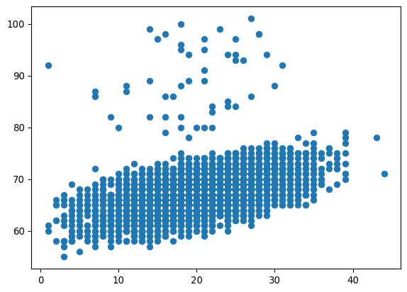
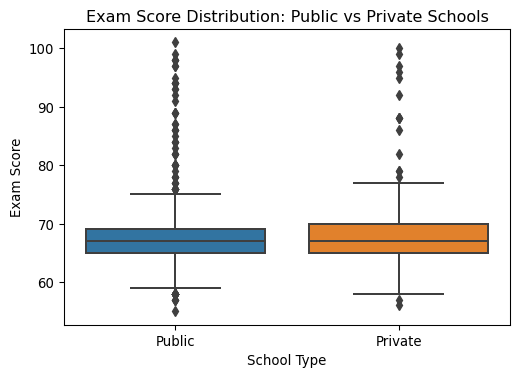
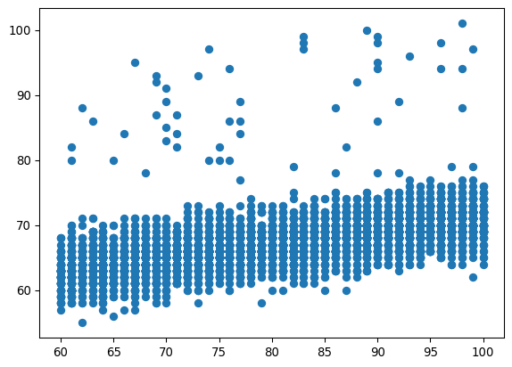
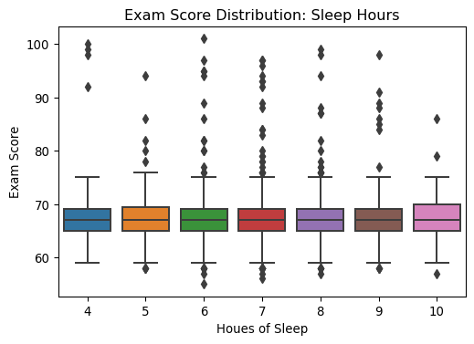
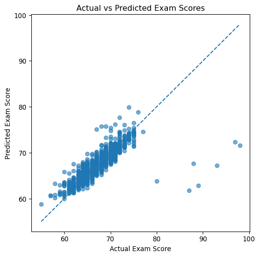

# Predicting Exam Scores


## Overview

As I head into finals this week, I wanted to look into the factors that
impact college students’ success on exams. I first want to visualize
metrics that I think would have a significant impact on a students exam
score to start understanding variable signficance. From there, I would
like to quantify their relationships through the means of an OLS model.
Finally, I want to see if I can predict a students exam score using
Random Forrest Regression.

Through this analysis I hope to understand:

1.  What factors most strongly influence a students exam performance,
    and therefore what should I prioritize this week?

2.  Can we predict exam score based off the available data?

## Purpose

Understanding which variables influence exam performance can help
students prioritize specific behaviors when aiming for educational
success. For example, if tutoring is not strongly associated with higher
exam scores, students may choose prioritize attendance or sleep to
improve their performance. Additionally, accurately being able to
predict exam score performance could be immensely useful to professors.
If they calculate that a student should earn a 90 but they recieve a 65,
there may have been an error when grading or they can speak to the
student to understand if something went wrong.

## The Data

The data I used for the project includes a variety of information about
students, their education, and behaviors. Variables included are both
numeric and categorical. Some metrics of importance include hours
studied, attendance hours, resource availability, and family income.

``` python
import pandas as pd
import matplotlib.pyplot as plt
import seaborn as sns
```

``` python
data = pd.read_csv("/Users/maddypitman/Downloads/StudentPerformanceFactors.csv")
data.head()
```

<div>
<style scoped>
    .dataframe tbody tr th:only-of-type {
        vertical-align: middle;
    }
&#10;    .dataframe tbody tr th {
        vertical-align: top;
    }
&#10;    .dataframe thead th {
        text-align: right;
    }
</style>

|  | Hours_Studied | Attendance | Parental_Involvement | Access_to_Resources | Extracurricular_Activities | Sleep_Hours | Previous_Scores | Motivation_Level | Internet_Access | Tutoring_Sessions | Family_Income | Teacher_Quality | School_Type | Peer_Influence | Physical_Activity | Learning_Disabilities | Parental_Education_Level | Distance_from_Home | Gender | Exam_Score |
|----|----|----|----|----|----|----|----|----|----|----|----|----|----|----|----|----|----|----|----|----|
| 0 | 23 | 84 | Low | High | No | 7 | 73 | Low | Yes | 0 | Low | Medium | Public | Positive | 3 | No | High School | Near | Male | 67 |
| 1 | 19 | 64 | Low | Medium | No | 8 | 59 | Low | Yes | 2 | Medium | Medium | Public | Negative | 4 | No | College | Moderate | Female | 61 |
| 2 | 24 | 98 | Medium | Medium | Yes | 7 | 91 | Medium | Yes | 2 | Medium | Medium | Public | Neutral | 4 | No | Postgraduate | Near | Male | 74 |
| 3 | 29 | 89 | Low | Medium | Yes | 8 | 98 | Medium | Yes | 1 | Medium | Medium | Public | Negative | 4 | No | High School | Moderate | Male | 71 |
| 4 | 19 | 92 | Medium | Medium | Yes | 6 | 65 | Medium | Yes | 3 | Medium | High | Public | Neutral | 4 | No | College | Near | Female | 70 |

</div>

## Exploring the Data: What factors seem to be most closely related to exam perfromance?

``` python
plt.scatter(data['Hours_Studied'], data['Exam_Score'])
plt.show()
```



I plotted a scatterplot to analyze the relationship between the hours a
student studied and their exam score. This is the best choice to
evaluate strength and direction of two continuous variables.

I would think study hours would be one of the greatest predictors of
exam success. While there is a general upward trend, there are also many
outliers that seem to do well regardless of their study time. This can
likely be attributed to natural ability.

``` python
plt.figure(figsize=(6,4))
sns.boxplot(data=data, x='School_Type', y='Exam_Score')
plt.xlabel('School Type')
plt.ylabel('Exam Score')
plt.title('Exam Score Distribution: Public vs Private Schools')
plt.show()
```



Next, I wanted to compare the spread of exam scores by private and
public schools. A boxplot using matplotlib was the most clear way to
accomplish this.

Exam scores to not appear to differ tremendously by Education Type. The
average score for both education types is around a 68. Both school types
also have outliers with similar ranges. This could be an interesting
factor to consider when looking at tuition costs and evaluating
differences in quality of eduction.

``` python
plt.scatter(data['Attendance'], data['Exam_Score'])
plt.show()
```



Attendance seems like it would also help predict a students exam score.
To explore the relationship a a scatterplot was the right choice for the
continuous variables.

Attendance has a similar relationship to exam scores as study hours.
There is an upward trend present, however, there are a fair amount of
students that perfrom well regardless of the hours of school they
attend.

``` python
plt.figure(figsize=(6,4))
sns.boxplot(data=data, x='Sleep_Hours', y='Exam_Score')
plt.xlabel('Houes of Sleep')
plt.ylabel('Exam Score')
plt.title('Exam Score Distribution: Sleep Hours')
plt.show()
```



Finally, I wanted to see if exam scores differ for student who get
different amounts of sleep. Since sleep is categorical in the sense that
there are only a few options, it made sense to use a boxplot.

Different hours of sleep do not impact scores obtained by students. The
average scores and spreads are no differnt across differnt amounts of
sleep. Normally I prioritize going to sleep extremely early if I have an
exam the next day but this data suggests that may not be the best
tactic.

## Modeling

I will be using OLS from statsmodels.formula.api to quantify the
relationship between the predictive variables and exam score.

``` python
import statsmodels.api as sm
import statsmodels.formula.api as smf
from sklearn.ensemble import RandomForestRegressor
from sklearn.model_selection import train_test_split
from sklearn.metrics import mean_squared_error, mean_absolute_error, r2_score
```

``` python
model = smf.ols("Exam_Score ~ Hours_Studied + Attendance", data=data).fit()
print(model.summary())
```

                                OLS Regression Results                            
    ==============================================================================
    Dep. Variable:             Exam_Score   R-squared:                       0.541
    Model:                            OLS   Adj. R-squared:                  0.541
    Method:                 Least Squares   F-statistic:                     3896.
    Date:                Wed, 10 Dec 2025   Prob (F-statistic):               0.00
    Time:                        09:13:35   Log-Likelihood:                -15776.
    No. Observations:                6607   AIC:                         3.156e+04
    Df Residuals:                    6604   BIC:                         3.158e+04
    Df Model:                           2                                         
    Covariance Type:            nonrobust                                         
    =================================================================================
                        coef    std err          t      P>|t|      [0.025      0.975]
    ---------------------------------------------------------------------------------
    Intercept        45.6042      0.252    180.743      0.000      45.110      46.099
    Hours_Studied     0.2931      0.005     54.140      0.000       0.282       0.304
    Attendance        0.1973      0.003     70.252      0.000       0.192       0.203
    ==============================================================================
    Omnibus:                     7183.361   Durbin-Watson:                   2.000
    Prob(Omnibus):                  0.000   Jarque-Bera (JB):           768940.589
    Skew:                           5.425   Prob(JB):                         0.00
    Kurtosis:                      54.725   Cond. No.                         648.
    ==============================================================================

    Notes:
    [1] Standard Errors assume that the covariance matrix of the errors is correctly specified.

Based off the available variables, hours studied and attendance seem
like they would have the strongest corelation to exam scores. After
making a model with only these variables, we see that the explained
variation in exam score is 54.1%. Both variables are significant and
have a positive impact on exam score.

It is estimated that for each hour studied, a students exam score will
increase by 0.29. For each additional hour in class, a students score
rises by 0.19 on average.

``` python
model = smf.ols("Exam_Score ~ Hours_Studied + Attendance + Tutoring_Sessions + Previous_Scores + C(Gender)", data=data).fit()
print(model.summary())
```

                                OLS Regression Results                            
    ==============================================================================
    Dep. Variable:             Exam_Score   R-squared:                       0.597
    Model:                            OLS   Adj. R-squared:                  0.596
    Method:                 Least Squares   F-statistic:                     1954.
    Date:                Wed, 10 Dec 2025   Prob (F-statistic):               0.00
    Time:                        09:13:35   Log-Likelihood:                -15350.
    No. Observations:                6607   AIC:                         3.071e+04
    Df Residuals:                    6601   BIC:                         3.075e+04
    Df Model:                           5                                         
    Covariance Type:            nonrobust                                         
    =====================================================================================
                            coef    std err          t      P>|t|      [0.025      0.975]
    -------------------------------------------------------------------------------------
    Intercept            41.2666      0.290    142.166      0.000      40.698      41.836
    C(Gender)[T.Male]    -0.0313      0.062     -0.508      0.611      -0.152       0.089
    Hours_Studied         0.2916      0.005     57.431      0.000       0.282       0.302
    Attendance            0.1977      0.003     75.062      0.000       0.193       0.203
    Tutoring_Sessions     0.4958      0.025     20.061      0.000       0.447       0.544
    Previous_Scores       0.0480      0.002     22.739      0.000       0.044       0.052
    ==============================================================================
    Omnibus:                     8049.633   Durbin-Watson:                   1.999
    Prob(Omnibus):                  0.000   Jarque-Bera (JB):          1236152.329
    Skew:                           6.526   Prob(JB):                         0.00
    Kurtosis:                      68.726   Cond. No.                     1.07e+03
    ==============================================================================

    Notes:
    [1] Standard Errors assume that the covariance matrix of the errors is correctly specified.
    [2] The condition number is large, 1.07e+03. This might indicate that there are
    strong multicollinearity or other numerical problems.

Adding more seemingly strong predictors, the R squared only increased by
5%. This suggests the addition of gender, tutoring, and previous scores
does not improve the model tremendously.

We do get one negative coefficient for being male, suggesting that men
score lower than women on average. However, this is not statistically
significant.

``` python
model = smf.ols(
    "Exam_Score ~ Hours_Studied + Attendance + Parental_Involvement + "
    "Access_to_Resources + Extracurricular_Activities + Sleep_Hours + "
    "Previous_Scores + Motivation_Level + Internet_Access + Tutoring_Sessions + "
    "Family_Income + Teacher_Quality + C(School_Type) + Peer_Influence + "
    "Physical_Activity + C(Learning_Disabilities) + C(Parental_Education_Level) + "
    "Distance_from_Home + C(Gender)",
    data=data
).fit()

print(model.summary())
```

                                OLS Regression Results                            
    ==============================================================================
    Dep. Variable:             Exam_Score   R-squared:                       0.722
    Model:                            OLS   Adj. R-squared:                  0.720
    Method:                 Least Squares   F-statistic:                     609.8
    Date:                Wed, 10 Dec 2025   Prob (F-statistic):               0.00
    Time:                        09:13:35   Log-Likelihood:                -13675.
    No. Observations:                6378   AIC:                         2.741e+04
    Df Residuals:                    6350   BIC:                         2.759e+04
    Df Model:                          27                                         
    Covariance Type:            nonrobust                                         
    ===============================================================================================================
                                                      coef    std err          t      P>|t|      [0.025      0.975]
    ---------------------------------------------------------------------------------------------------------------
    Intercept                                      41.8286      0.338    123.710      0.000      41.166      42.491
    Parental_Involvement[T.Low]                    -1.9829      0.075    -26.309      0.000      -2.131      -1.835
    Parental_Involvement[T.Medium]                 -1.0624      0.061    -17.557      0.000      -1.181      -0.944
    Access_to_Resources[T.Low]                     -2.0633      0.075    -27.469      0.000      -2.211      -1.916
    Access_to_Resources[T.Medium]                  -1.0096      0.060    -16.807      0.000      -1.127      -0.892
    Extracurricular_Activities[T.Yes]               0.5620      0.053     10.615      0.000       0.458       0.666
    Motivation_Level[T.Low]                        -1.0620      0.075    -14.101      0.000      -1.210      -0.914
    Motivation_Level[T.Medium]                     -0.5423      0.069     -7.916      0.000      -0.677      -0.408
    Internet_Access[T.Yes]                          0.9247      0.098      9.442      0.000       0.733       1.117
    Family_Income[T.Low]                           -1.0856      0.072    -15.115      0.000      -1.226      -0.945
    Family_Income[T.Medium]                        -0.5906      0.072     -8.210      0.000      -0.732      -0.450
    Teacher_Quality[T.Low]                         -1.0575      0.094    -11.207      0.000      -1.242      -0.873
    Teacher_Quality[T.Medium]                      -0.5490      0.058     -9.453      0.000      -0.663      -0.435
    C(School_Type)[T.Public]                        0.0327      0.056      0.579      0.563      -0.078       0.143
    Peer_Influence[T.Neutral]                       0.5222      0.070      7.415      0.000       0.384       0.660
    Peer_Influence[T.Positive]                      1.0270      0.070     14.653      0.000       0.890       1.164
    C(Learning_Disabilities)[T.Yes]                -0.8538      0.085    -10.074      0.000      -1.020      -0.688
    C(Parental_Education_Level)[T.High School]     -0.4858      0.060     -8.119      0.000      -0.603      -0.369
    C(Parental_Education_Level)[T.Postgraduate]     0.5027      0.075      6.734      0.000       0.356       0.649
    Distance_from_Home[T.Moderate]                  0.3879      0.095      4.098      0.000       0.202       0.574
    Distance_from_Home[T.Near]                      0.9077      0.089     10.225      0.000       0.734       1.082
    C(Gender)[T.Male]                              -0.0422      0.053     -0.802      0.422      -0.145       0.061
    Hours_Studied                                   0.2949      0.004     68.009      0.000       0.286       0.303
    Attendance                                      0.1988      0.002     88.363      0.000       0.194       0.203
    Sleep_Hours                                    -0.0020      0.018     -0.112      0.911      -0.037       0.033
    Previous_Scores                                 0.0489      0.002     27.071      0.000       0.045       0.052
    Tutoring_Sessions                               0.4982      0.021     23.699      0.000       0.457       0.539
    Physical_Activity                               0.1867      0.025      7.385      0.000       0.137       0.236
    ==============================================================================
    Omnibus:                    10556.728   Durbin-Watson:                   2.008
    Prob(Omnibus):                  0.000   Jarque-Bera (JB):          5019643.307
    Skew:                          11.388   Prob(JB):                         0.00
    Kurtosis:                     138.535   Cond. No.                     1.49e+03
    ==============================================================================

    Notes:
    [1] Standard Errors assume that the covariance matrix of the errors is correctly specified.
    [2] The condition number is large, 1.49e+03. This might indicate that there are
    strong multicollinearity or other numerical problems.

Using all the variables in the dataset has the highest R squared of the
models created thus far. 72.2% of variation in exam scores can be
explained when including all of the available variables. Only a few
variables are not regarded as statistically significant and these
include medium teacher quality, being male, and sleep hours.

The metric with the greatest quantitative impact on exam score is low
access to resources. Students with low access to resources are expected
to score 2 points lower than a student with all other similar
conditions. The second greatest impact is positive peer influence. This
suggests that students in a supportive student environment tend to score
1 point higher on the exam than students who are not in a positive
environment. This is an interesting way to see how the energy and
mindset of those around you impact your success.

## Predicting Exam Score

I am using Random Forrest Regression to predict a students exam score
based on the data. Since there are a number of categorical variables I
used get_dummies to convert them into usable categical numbers. Further,
I broke the data into a train and test set to fit a model to the
training data then evaluate its performance on the test data. Finally, I
computed performance metrics to understand how well the model does.

``` python
df = pd.get_dummies(data, drop_first=True)

X = df.drop("Exam_Score", axis=1)
y = df["Exam_Score"]

X_train, X_test, y_train, y_test = train_test_split(
    X, y, test_size=0.2, random_state=42
)

rf = RandomForestRegressor(n_estimators=500, random_state=42)
rf.fit(X_train, y_train)

preds = rf.predict(X_test)

rmse = mean_squared_error(y_test, preds, squared=False)
mae = mean_absolute_error(y_test, preds)
r2 = r2_score(y_test, preds)

print("RMSE:", rmse)
print("MAE:", mae)
print("R²:", r2)
```

    RMSE: 2.225020452743883
    MAE: 1.175018154311649
    R²: 0.6497565877666611

``` python
plt.figure(figsize=(6,6))
plt.scatter(y_test, preds, alpha=0.6)
plt.plot([y_test.min(), y_test.max()], [y_test.min(), y_test.max()], '--')
plt.xlabel("Actual Exam Score")
plt.ylabel("Predicted Exam Score")
plt.title("Actual vs Predicted Exam Scores")
plt.show()
```



The models performance is moderately strong in its ability to predict
exam scores. The RMSE expresses that the models predictions on average
differ from the true score by 2.2 points. This is a very small margin.

The R square reflects that 64.9% of variation in exam scores can be
explained by the model. This is a good score but could be stronger.

Overall, this model does a decent job predicting exam score. It would be
interesting to see how adding variables like previous experience in the
subject or motivation impact scores. Motivation could be measured by:
whether or not the student is trying to find a job, whether they plan on
pursuing a career in that subject, etc.

## Takeaways

After performing both linear regression and predictive modeling, we can
see that most variables available in the dataset have a significant
effect on student exam scores. The metrics with the highest quantitative
coefficients on exam scores were low access to resources and supportive
environments. There is also a strong relationship between hours studied
and the number of hours a student is in class. Therefore, both
environmental and individual factors influence student success so both
should be priotized for students aiming for As. Further, exam scores can
be moderately accurately predicted by all metrics. This information
could be very useful to university professors to understand if students
are severely under or overperforming on their tests. Knowing this could
also reflect the professors teaching ability and help them reflect on
teaching changes they could want to make.
